# Workflow Diagrams

Visual state-machine diagrams for the workflow examples.
All diagrams use [Mermaid](https://mermaid.js.org/) syntax and render natively in GitHub, GitLab, and most Markdown previewers.

---

## Example 13 — Core Workflow Features

### 13-1: Basic `run()` with guard transition

A guard fires automatically when the draft reply contains `"ready"`.

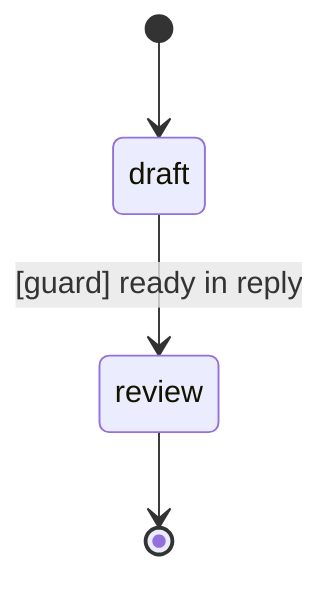

---

### 13-2: Manual `step()` stepping

Two states connected by a guard on `"complete"`.
Each `step()` call executes the current state exactly once and advances if the guard matches.

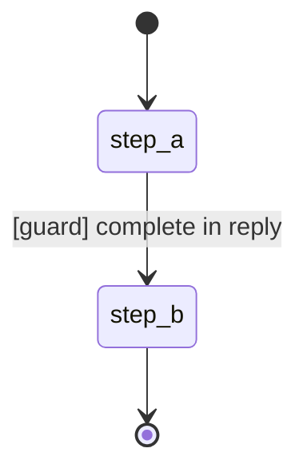

---

### 13-3: `event()` transition

Guard fires forward (draft → review on `"submitted"`); a named event `reject` sends the workflow back.

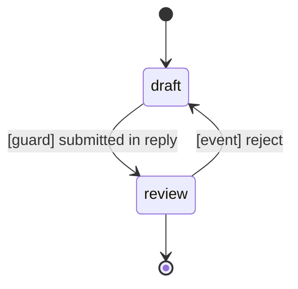

---

### 13-4: Both guard and event transitions on the same state

`analyse` can advance by guard (to `approve`) or by event `escalate` (to `escalate`).

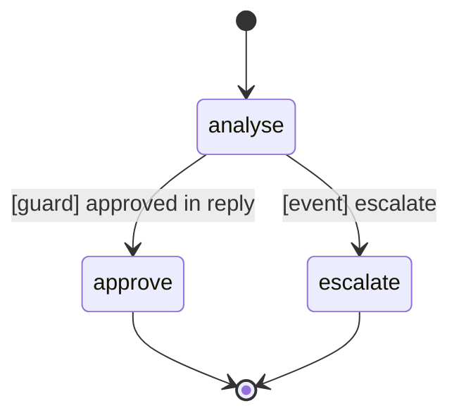

---

### 13-5: Runtime modification — add state and transition

**Before** — only `draft` is registered at startup:

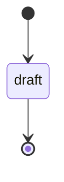

**After** — `polish` and its guard transition are added at runtime via `add_state()` + `add_transition()`:

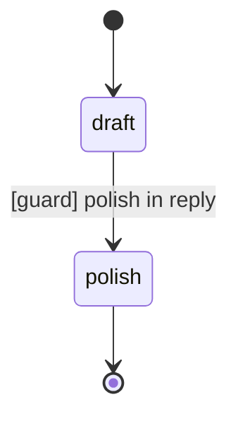

---

### 13-6: `set_state()` — force-jump

The workflow is force-jumped directly to `approve`, skipping `review`.

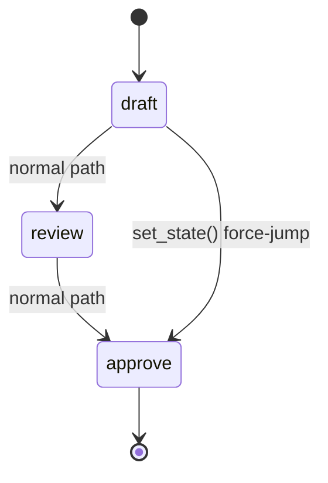

---

### 13-7: `current_state()` and `last_output()` inspection

A single-state terminal workflow. After `run()`, both inspection methods reflect the completed execution.

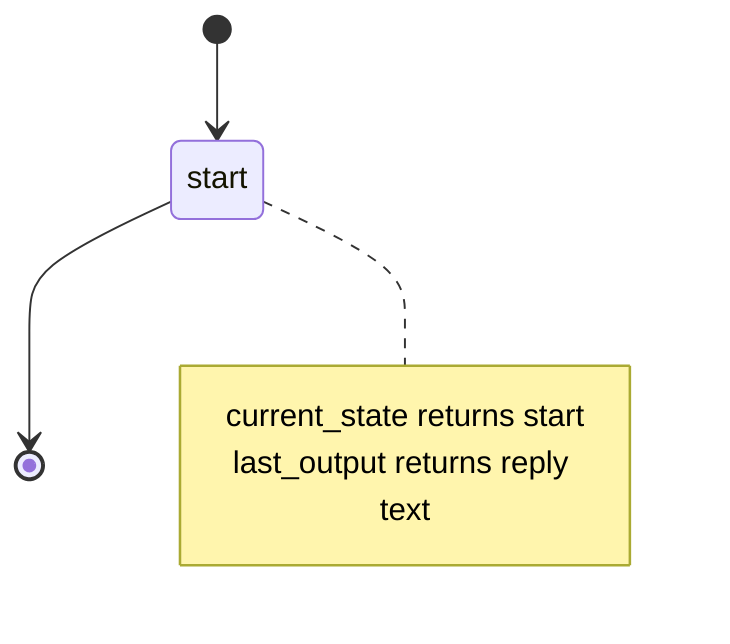

---

## Example 14 — Parallel Actors and Async Execution

### 14-1: Parallel actors in a single state

Both actors receive the same instruction simultaneously via a fork; their replies are combined at the join.

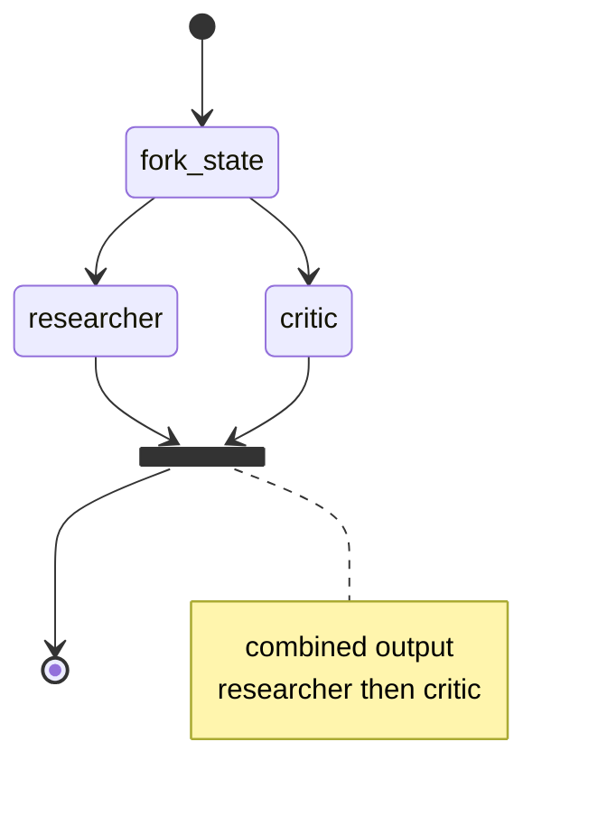

---

### 14-2: Guard transition fires on combined parallel output

The guard matches a keyword from one of the parallel actors; both are wrapped in a composite `analyse` state.

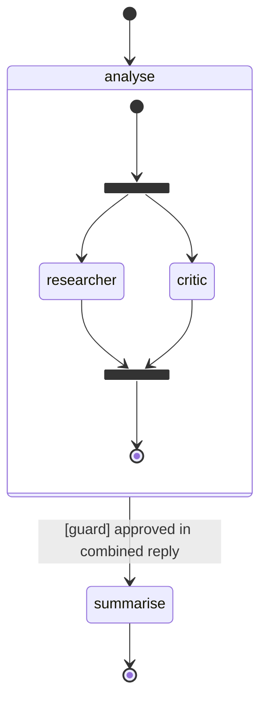

---

### 14-3: Mixed states — single actor then parallel actors

A single-actor `summarise` state transitions unconditionally into a parallel `analyse` state.

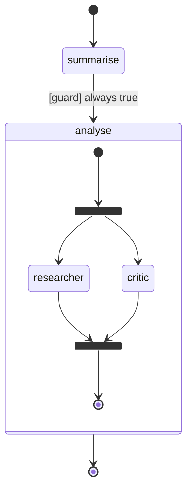

---

### 14-4: `run_detached()` with `on_complete` callback

The workflow runs in a background thread. The calling thread is free immediately and receives the result via callback.

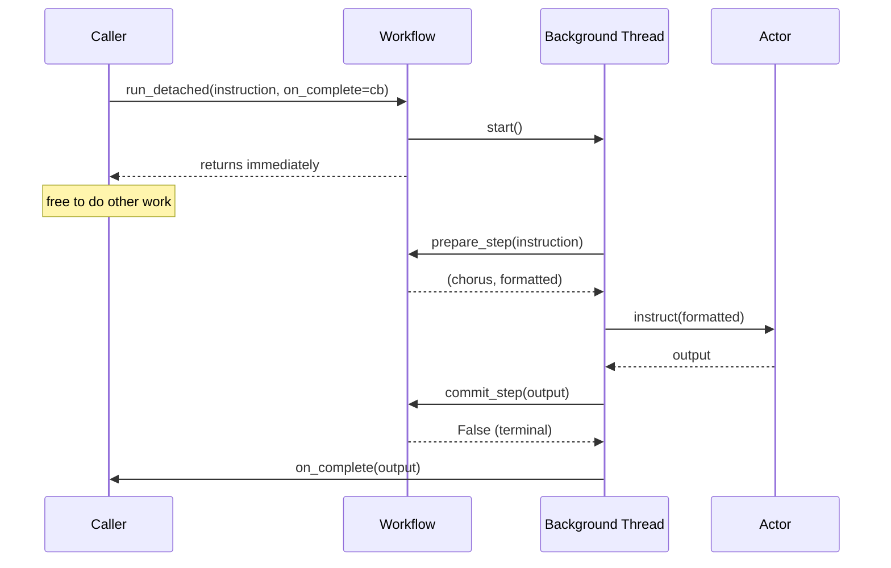

---

### 14-5: `run_detached()` with `on_error` callback

A missing state triggers a `KeyError` in the background thread and is delivered via `on_error`.

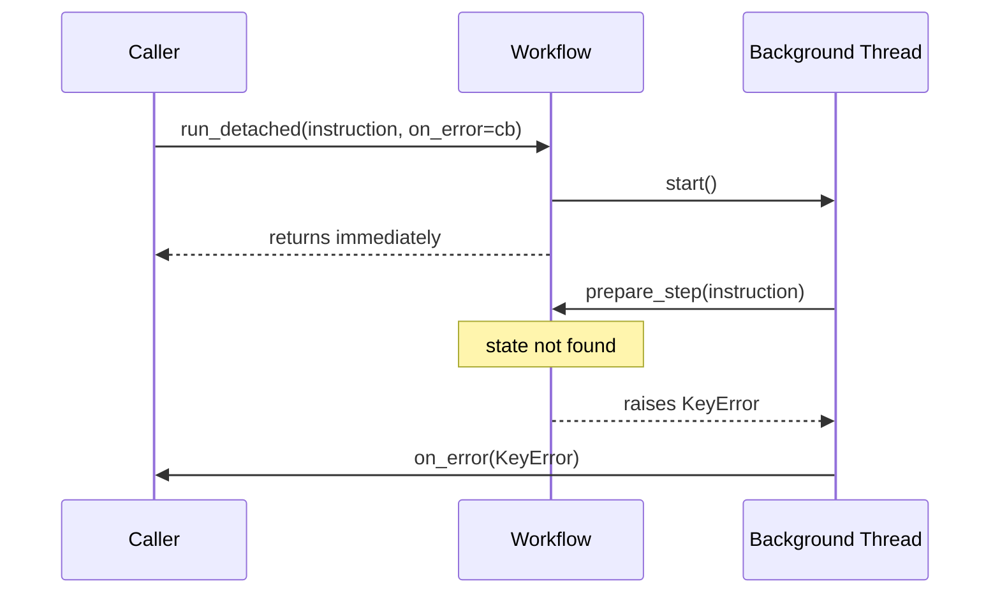

---

### 14-6: `event()` fired while `run_detached()` is running

The workflow actor's mailbox stays free during detached execution, so `event()` can be dispatched concurrently.

State machine:

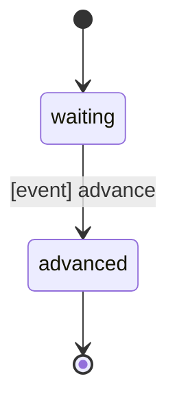

Execution sequence:

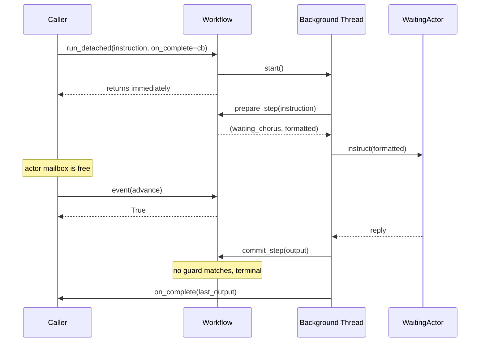

---

### 14-7: `prepare_step()` / `commit_step()` — custom orchestration

Three-phase manual execution: prepare reads state atomically; execute runs outside the workflow thread; commit writes output and advances.

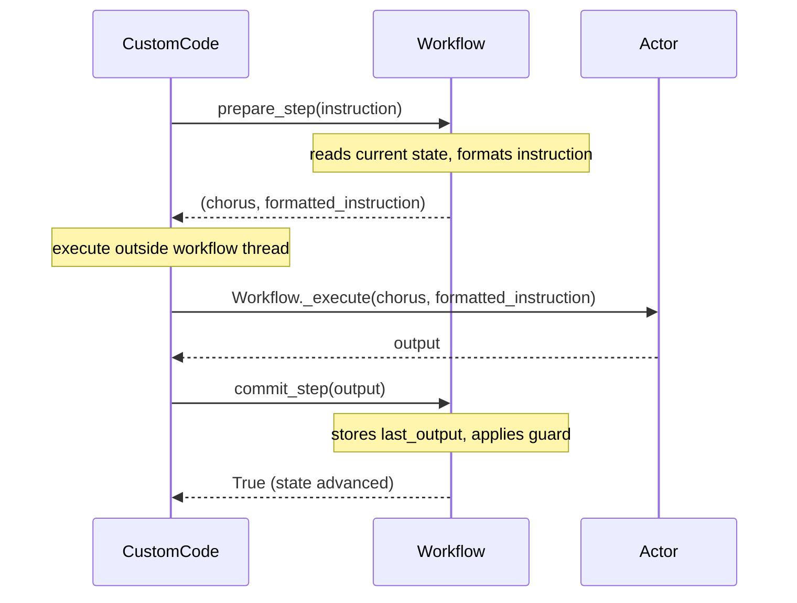

State machine:

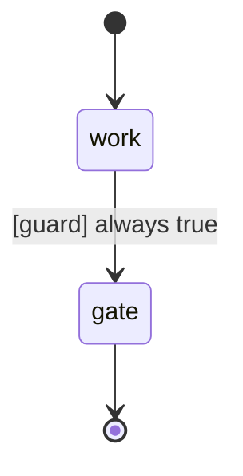

---

## Workflow Execution Modes — Summary

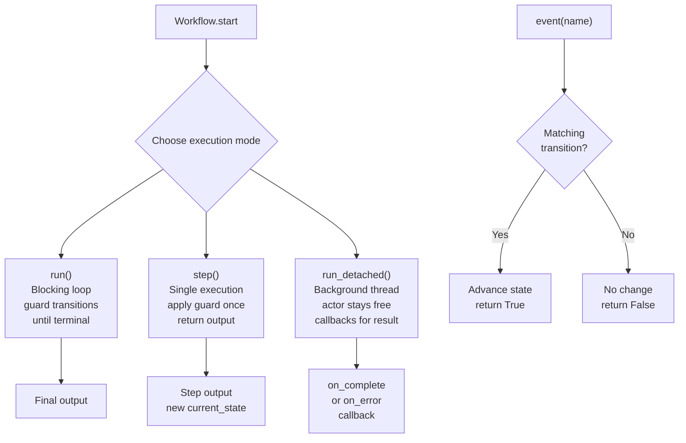
